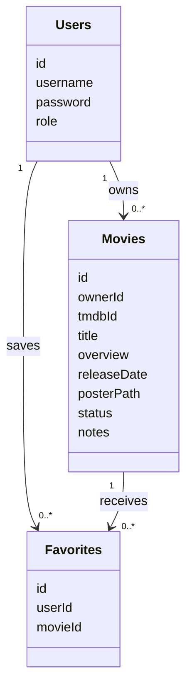
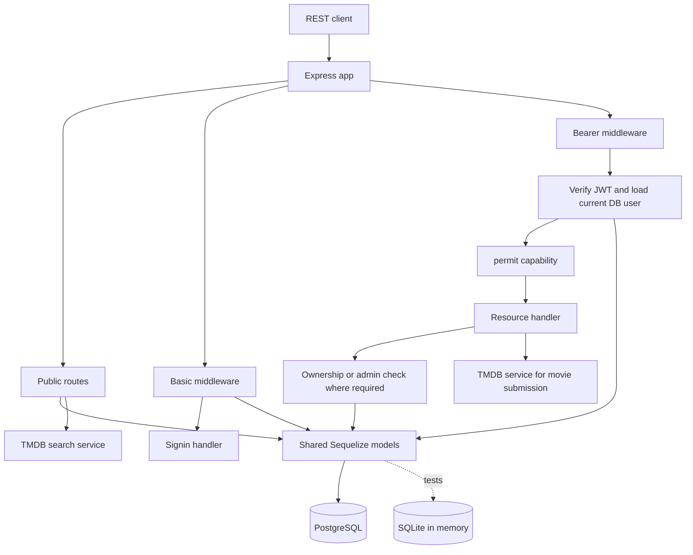

# aal-movies-DB

- Setup: Node `20.20.2`, `npm ci`, private `.env`, separate PostgreSQL database, `npm run dev`.
- Commands: `npm test` and `npm start`.
- Contract: link to [`docs/team-contract.md`](docs/team-contract.md).
- Status: four foundation tests pass; local PostgreSQL startup and HTTP health response verified on port 3001. model registration, feature routes, authorization pending; deployment optional.

## UML

## Model Diagram

### Request-Flow Diagram

Public health bypasses the database.
Public stored-movie reads use the database.
Basic signin creates the token later verified by Bearer middleware.  
The diagram describes the planned complete system, including features still pending.

## changelog

### antonio - integration/deployment, and favorites

- `npm init -y` to create `package.json`.
- installed ` express`, `axios`, `dotenv`, `cors`, `jest`, `supertest`, `sequelize`,`pg` through `npm`.
- `git init` to tie to github repo.
- created simple express server; **`server.js`**.
- defined **`.env.example`**.
- created **`/docs/team-contract.md`** as a reminder of project scope and team responsibility shared reference.
  - updated policy regarding user account deletion.
- installed ` bcrypt@6.0.0` (password hashing), `jsonwebtoken@9.0.2` (token signing/verification), -dev `sqlite3@5.1.7` (test database).
- updated `"scripts"` to include `"start"` and `"dev"`, as well as add `"engines"` cmds; **`package.json`**.
- Established Express health endpoint and separated startup; `src/server.js`
  - `index.js`; startup entry.
- **`src/error-handlers`**;
  - created `404.js`, resource not found.
  - created `500.js`, invalid JSON parsing.
- **`server.js`**,
  - temp compatability entry to `index.js` (will remove after testing).
- `src/models/index.js`,
  - Configured shared database connection.
- **`jest.config.js`**;
  - discovers matching tests in test directory.
- **`__tests__/integration/foundation.test.js`**;
  - foundation tests that cover observable behavior and SQLite connectivity.
    - not model constarints,ownership, or PostgreSQL connectivity.
- **`.github/workflows/ci.yml`**;
  - installs from lockfile and runs same test cmd; w/o PostgreSQL nor TMDB creds.
- Verified health, error responses, and SQLite connectivity; `__tests__/integration/foundation.test.js` — 4 tests passed.
- Verified PostgreSQL startup and HTTP health response; `index.js`, `GET /health`.
- **`src/favorites/favorite-model.js`**;
  - added Favorites model and duplicate constraints factory.
- registered shared models and enforced relationships and movie deletion cascade;b
  - **`src/models/index.js`**, 
- **`index.js`**
  - initialized missing DB tables during startup, before listening; `await db.sync();`.
- **`__tests__/auth/user-model.test.js`**
  - updated to import `{ db`, `users: User }` from `../../src/models.js`
- `__tests__/integration/models.test.js`;
  - Verified shared model constraints and movie-to-favorites cascade.

### amity - movies

### luis - users